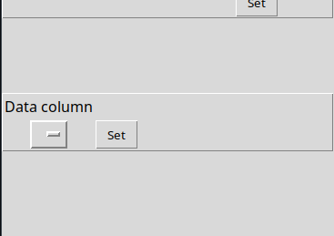
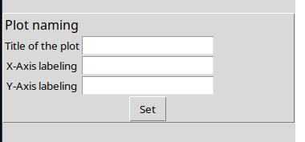
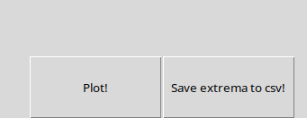
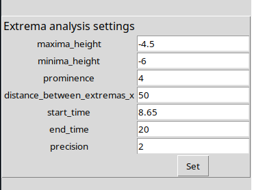
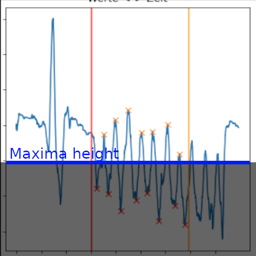
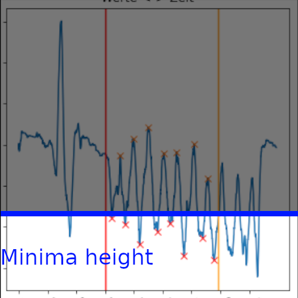
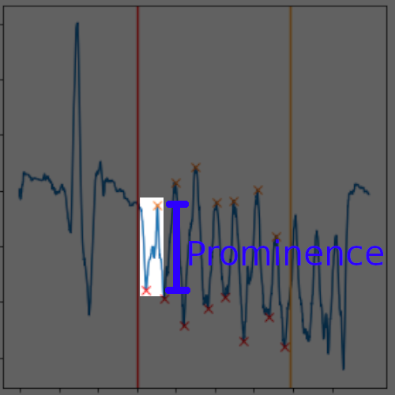
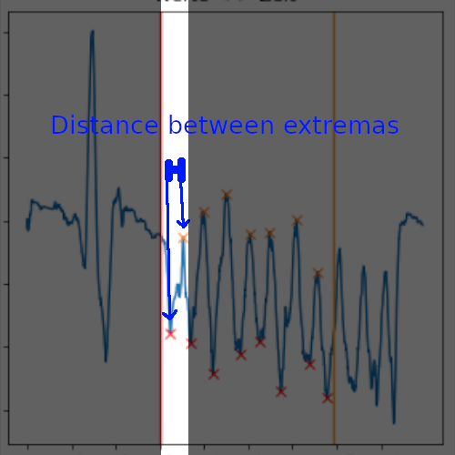
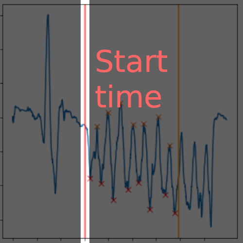
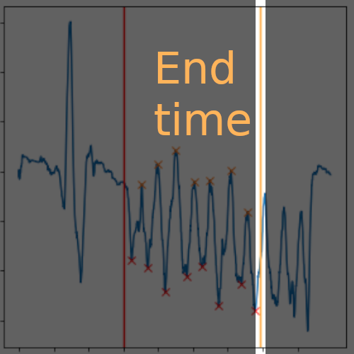

- [Prerequisites](#prerequisites) 
- [Usage](#usage) 
- [Open and plot .mot file](#open-and-plot-mot-file) 
  - [Open a .mot file](#open-a-mot-file) 
  - [Create plot](#create-plot) 
  - [Changing analysis data](#changing-analysis-data) 

# Prerequisites

- [Python installed](https://www.python.org/downloads/)

# Usage

1. create a new virtual environment: `python -m venv ./venv` or `python3 -m venv ./venv`
2. install all requirements: `./venv/bin/pip install -r requirements.txt`
3. run the app: `./venv/bin/python main.py`

# Open and plot .mot file

## Open a .mot file

- In the menu press "File" -> "Open"
- Select the .mot file to open

## Create plot

1. Select the data column to be plotted against time 
   <small>Click on the dropdown menu (left to "Set")</small> 
   *<u>After selecting press "Set"</u>* 
   

2. **(Optional)** 
   Change naming of the plot 
   *<u>After naming press "Set"</u>* 
   

3. Press "Plot!" 
   <small>At the bottom of the application</small> 
   

## Changing analysis data

1. Select the data column to be plotted against time 
   <small>Click on the dropdown menu (left to "Set")</small> 
   *<u>After selecting press "Set"</u>* 
   

2. Press "Plot!" 
   <small>At the bottom of the application</small> 
   

3. Change the analysis data 
   

| variable                    | description                                                                                              | Example picture                                                             |
|-----------------------------|----------------------------------------------------------------------------------------------------------|-----------------------------------------------------------------------------|
| maxima_height               | The minimum height a maxima must have                                                                    |           |
| minima_height               | The maximum height a minima may have                                                                     |           |
| prominence                  | The minimum distance between minima maxima                                                               |                 |
| distance_between_extremas_x | The minimum distance between selected extremas                                                           |  |
| start_time                  | The start of the extrema analysis                                                                        |                 |
| end_time                    | The end of the extrema analysis                                                                          |                     |
| precision                   | The accuracy of the speed calculation from the extremes in the number of digits after the decimal point. |                                                                             |